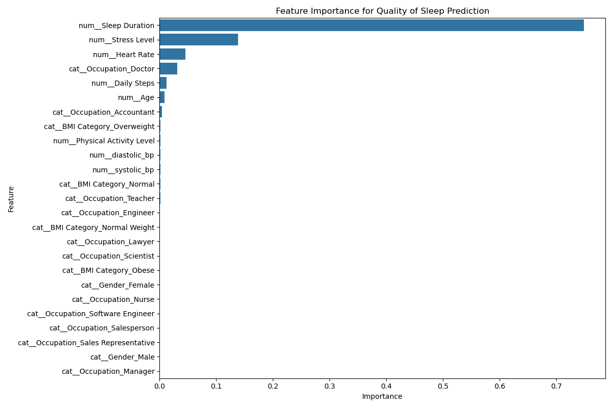
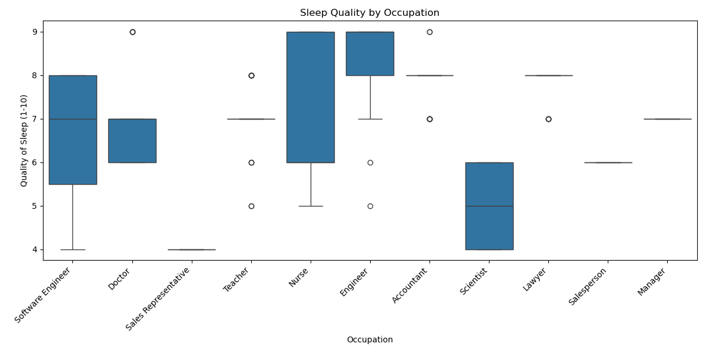

# Project: Sleep Quality Prediction Analysis
This is a complete data science workflow focused on predictive modeling, built to validate core machine learning and data engineering proficiency.

## Project Overview

This project explores the relationship between various lifestyle and health metrics and an individual's sleep quality (a score on a 1–10 scale). The primary objective was to develop a robust machine learning pipeline capable of accurately predicting this score, while providing clear insights into the factors that influence sleep health.

## Methodology and Model Comparison

### Component	Technology / Concept	Significance

Data Preprocessing	Scikit-learn Pipeline, StandardScaler, OneHotEncoder	Established a robust, clean pipeline to handle both numerical and categorical features, ensuring data normalization and preventing data leakage across training and test sets.
Baseline Model	Linear Regression	Established an interpretable baseline (R^2=0.95) to quantify the minimal compute necessary for highly accurate prediction.
Optimization	Random Forest Regressor + GridSearchCV	Systematically tuned hyperparameters to minimize error, achieving superior test performance (R^2=0.98), demonstrating expertise in model refinement and optimization.
Model Artifact	Joblib Serialization	The best-performing model was saved to disk as a final artifact, showcasing model preparation for deployment.

## Feature Importance

## Sleep Quality by Occupation

## Comparison of the Relationship Between Sleep Duration and Quality

